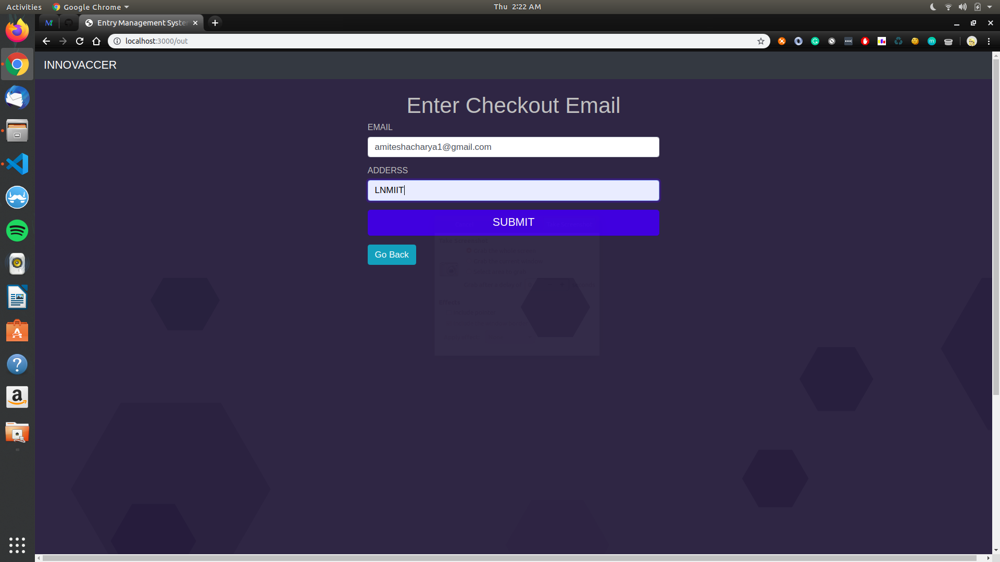

# Entry Management System

## Assignment for SDE-Intern at Innovaccer

### Prerequisites
-   Nodejs v8.10.0
-   NPM Packages
-   HTML5, CSS3, Javascript
-   A Gmail Account
-   Fast2sms API and Secret Key
-   World Time API

### Deployment

The website has been hosted on Heroku and can be easily accessed [here](https://pure-savannah-87720.herokuapp.com/).

## Technology Stack

#### Frontend
-   HTML5
-   CSS3
-   Javascript
-   Bootstrap v4.3.1
-   jQuery

#### Backend
-   Nodejs v8.10.0
-   Express
-   npm Packages

#### Database
-   MongoDB ( Non- Relational Database )

## Why Nodejs
-   Node.js is an open-source, cross-platform, JavaScript runtime environment that executes JavaScript code outside of a browser.
-   Node. js is primarily used for non-blocking, event-driven servers, due to its single-threaded nature. It's used for traditional web sites and back-end API services, but was designed with real-time, push-based architectures in mind.

## Why MongoDB
-   MongoDB is used to implement a data store that provides high performance, high availability, and automatic scaling. It is extremely simple to install and implement. MongoDB uses JSON or BSON documents to store data.

## Folder Structure


# Approach
-   First, when the landing page of the website renders, the user has the choice to checkin or checkout.


> Landing page view

## Checkin Implementation:-
-   When the user clicks on the check-in button the server redirects the user to the check-in form, the user enters his name, email, phone no., host's name, host's email and host's phone no. and clicks on the submit button. The form data is sent to the backend using  'body-parser' package and stored in local variables, then using 'mongoose' a schema is created then the data in the local variables are stored to the database with the data timestamp is also stored as check-in time and the user is checked-in, an sms and an email is sent to host informing about the same. After each check-in, the user is redirected to the landing page of the website.

## Checkout Implementation:-
-   When the user clicks on the check-out button the server redirects the user to the check-out form then the user enters his email address and host's address and clicks on submit then the form data and the checkout timestamp are send back to local variables updating the database and an email is sent to the user confirming the checkout.

## Checkin Demo


> Checkin form page


> Checkin Email view


> SMS view

## Checkout Demo


> Checkout form page


> Checkout email view


> Database view

## Data-Log
-  Fetch all the entries from the Database and present in tabular format on '/data' route.

> Data-log View 


## Dependencies
```bash
 express
 body-parser
 mongoose
 nodemailer
 unirest
 ejs
 email-validator
 validate-phone-number-node-js
 dotenv
 get-json
```

## Constraints
1.  A user can't checkin if he/she has  not checked out after a visit.
2.  Multiple checkout is not possible for a single user in a row.
3.  User can't submit Checkin/Checkout forms till all the fields are filled and are valid.


> Cannot click submit button till all the fields are valid.


> Cannot checkin until the user has not checked out.


> Cannot checkout if already checked out.

## Setup Enviroment Variables
-   Setup Enviroment Variables to connect to database and to send Email and SMS.

1.  Create a `.env` file in your Project folder and fill the following details:-

```
PORT=
IP=localhost
MONGODB=mongodb://localhost/
EMAIL_ID=
EMAIL_PASS=
TEXT_API=
```

2. Fill an empty port number, a database name after 'localhost/', email_id and password of a    gmail account to sent email and free2sms DEV-API Secret Key to sent SMS.


## Installation for Local-Systems
1.  Create a folder 'Innovaccer' in your home directory ` mkdir Innovaccer `
2.  Copy the content of the zip to the folder.
3.  Enter the folder: ` cd Innovaccer `
4.  Install dependencies: ` npm install `
5.  Start your MongoDB Server ` sudo service mongod start `
6.  Start application: ` node app.js `
7.  Visit [http://localhost:3000]("http://localhost:3000") to view the application.

## Contact
-  Author: Amitesh Acharya
-  Email: amiteshacharya1@gmail.com


